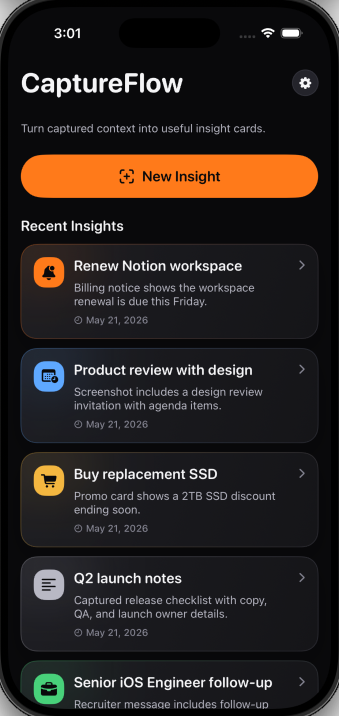

<p align="center">
  
</p>

# CaptureFlow

CaptureFlow is an open-source iOS app and reference architecture for turning screenshots into structured AI insight cards.

<p align="center">
  
</p>

<p align="center">
  <video src="docs/assets/captureflow-demo.mp4" controls width="320" poster="docs/assets/captureflow-demo.png"></video>
</p>

<p align="center">
  <a href="docs/assets/captureflow-demo.mp4">Watch the demo video</a>
</p>

## Summary

CaptureFlow turns screenshots and captured images into actionable AI insight cards, helping users prevent useful screenshots from becoming forgotten camera-roll clutter.

The app can import or capture an image, analyze it with an AI vision provider, generate an editable card, save it locally, export it as Markdown, and turn supported cards into Reminders or Calendar events.

The current AI-backed provider uses OpenAI for screenshot/image analysis and generation. Apple Foundation Models can be used for card generation only on supported iOS 26+ devices.

The codebase is designed with clear service boundaries, so developers can replace the default LLM, prompt, storage, or action integrations.

## Why CaptureFlow?

Most screenshots contain useful context, but they usually become forgotten camera-roll clutter. CaptureFlow turns screenshots into structured, editable, and reusable insight cards.

Unlike a one-off chat prompt, CaptureFlow provides a reusable iOS pipeline for:

- vision analysis
- prompt-based card generation
- local persistence
- Markdown export
- Reminder and Calendar integration
- provider-based LLM replacement

## Features

- Capture or import screenshots and images
- Analyze visual context with an AI vision provider
- Generate editable AI insight cards
- Save cards locally on device
- Export cards as Markdown
- Create Reminders and Calendar events from supported cards
- Bring your own LLM provider
- Optional Apple Foundation Models generation on iOS 26+
- Designed as a reference architecture for AI-native iOS apps

## Quick Start

1. Clone the repository and open `CaptureFlow.xcodeproj` in Xcode.
2. Configure an OpenAI API key for AI-backed screenshot analysis and generation.
3. Build and run the `CaptureFlow` scheme on an iOS simulator or device.
4. Optional: switch generation between External LLM and Apple Foundation Models in Settings when Foundation Models are available.

An OpenAI API key is required for AI-backed screenshot/image analysis. Without a key, the app can still be built, but AI analysis features will not produce real results.

## API Key Setup

API keys are not entered in the app UI. Configure OpenAI-backed analysis and generation with Xcode scheme environment variables:

```text
CAPTUREFLOW_AI_PROVIDER=openai
CAPTUREFLOW_OPENAI_API_KEY=your-api-key
```

`OPENAI_API_KEY` is also accepted as a fallback key name. These values can also be supplied in `CaptureFlow/Resources/LocalSecrets.plist`, which is ignored by git:

```xml
<?xml version="1.0" encoding="UTF-8"?>
<!DOCTYPE plist PUBLIC "-//Apple//DTD PLIST 1.0//EN" "http://www.apple.com/DTDs/PropertyList-1.0.dtd">
<plist version="1.0">
<dict>
  <key>CAPTUREFLOW_AI_PROVIDER</key>
  <string>openai</string>
  <key>CAPTUREFLOW_OPENAI_API_KEY</key>
  <string>your-api-key</string>
</dict>
</plist>
```

## Foundation Models Support

Apple Foundation Models are used for card generation only when available. Screenshot/image vision analysis currently still requires an external vision-capable provider such as OpenAI.

Foundation Models support requires:

- iOS 26+
- supported Apple Intelligence devices
- availability of Apple Foundation Models on the device

Users can switch generation between External LLM and Apple Foundation Models from Settings when Foundation Models are available.

## Bring Your Own Provider

CaptureFlow is provider-based by design. You can replace the default OpenAI implementation with your own provider by implementing:

- `VisionAnalysisProviding` for screenshot/image understanding
- `LLMProviding` for card generation

Then register your implementation in `AppContainer.local()`.

- Use `LLMProviderConfiguration` to define provider display name and default model names.
- Replace `VisionAnalysisPromptProviding` or `CardGenerationPromptProviding` to customize prompts.
- Features should continue to depend on `VisionAnalyzing` and `CardGenerating`, not concrete provider implementations.

For more detail, see [Architecture](docs/ARCHITECTURE.md).

## Build & Test

```sh
xcodebuild -project CaptureFlow.xcodeproj -scheme CaptureFlow -destination 'generic/platform=iOS Simulator' IPHONEOS_DEPLOYMENT_TARGET=18.0 build
```

Run tests:

```sh
xcodebuild test -project CaptureFlow.xcodeproj -scheme CaptureFlow -destination 'platform=iOS Simulator,name=iPhone 16 Pro Max,OS=18.6'
```

If your simulator name differs, replace the destination with an installed simulator.

## Requirements

- iOS 18.0 minimum deployment target
- Xcode 26.3 or newer is recommended
- iOS 18 simulator runtime or newer
- Apple Foundation Models require iOS 26+ and supported devices

## Roadmap

- [ ] OCR-only baseline mode
- [ ] More card templates
- [ ] Prompt customization
- [ ] More export options
- [ ] macOS support
- [ ] Multiple screenshot support
- [ ] Partial generation support
- [ ] More useful actions

## Open Source

- Contributions: [CONTRIBUTING.md](CONTRIBUTING.md)
- Code of conduct: [CODE_OF_CONDUCT.md](CODE_OF_CONDUCT.md)
- Security policy: [SECURITY.md](SECURITY.md)
- License: [MIT](LICENSE)
